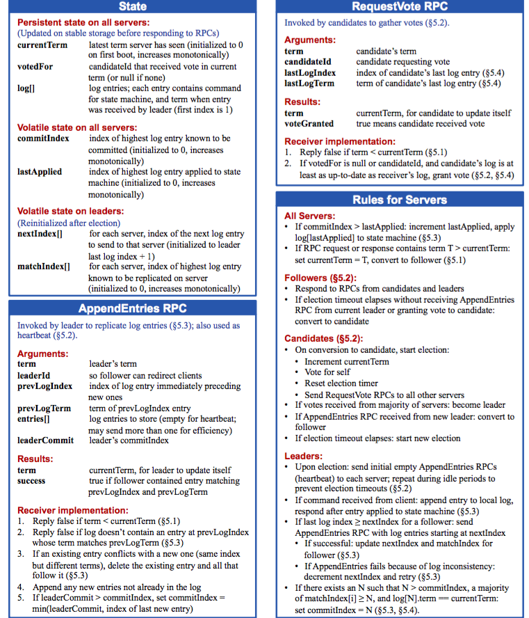
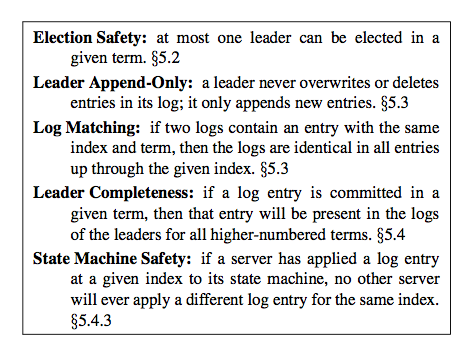
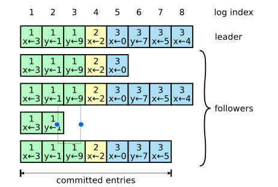
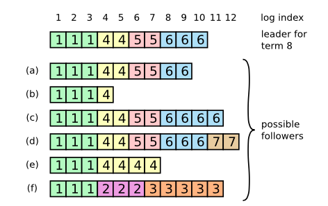
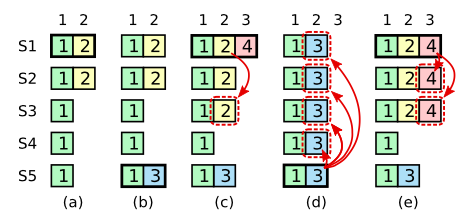

### 5 Raft 一致性算法

图表2：Raft算法的概要总结（不包括日志合并和成员变更）。server的行为在左上的图框里是一系列的规则，独立的可重复的触发。5.2章指示了哪里讨论算法的关键点。正式的说明更好地描述了算法。

图表3：Raft保证了这些属性在任何情况下都是True,章节数字指示了每一个实在什么地方讨论

Raft 算法可以管理复制日志通过第二章描述的方式。图表2总结了算法。图表3列出了算法的关键的属性。这些图标的元素会在接下来的章节中分段讨论。

Raft 实现一致性的方法是通过首先选举出leader，然后给予leader管理日志复制的所有权限。leader接受client的日志实体的请求，然后把他们复制到其它server，并告诉其它server什么时候想状态机提交日志实体是安全的。有一个leader简化了复制日志的管理。比如，leader可以不用那个询问其它server就决定在日志那个位置存放日志实体，而且数据流指示简单的从leader到其它server。leader可以挂掉或则和其他server断链，这是一个新的leader就会被选举出来。

因为有leader选举，Raft把一致性问题分解为三个近乎独立的子问题，下面讨论这些分项：

* Leader选举：当老的leader挂掉后，新的leader必须被选出来（5.2章节）
* 日志复制：leader必须从client接受日志实体，并把它们复制到集群，保证其它server的日志和它的一致（5.3章）
* 安全性：Raft的关键属性是图表3中的State Machine Safety.同一个索引上的日志只能有一个日志实体。5.4章讨论了如何实现前者。实现的方法包括5.2章描述的特使的限制机制。

介绍完一致性算法，后面的章节会介绍可用性，和定时器的作用。

#### 5.1 Raft基础

图表4。server状态follower只响应其它server的请求，如果follower没有接受到请求，他会成为一个candidate，并发起一个选。一个candidate得到大多数server的投票可以成为leader，leader不会变化之道它挂掉。

图表5.时间被分成不同的阶段，每个个阶段从选举开始。选举成功后，一个leader管理集群直到期间结束。一些选举失败了，也就没有选出leader。每个阶段的过渡期，不同的server发生在不同的时间。

一个raft集群包含好几个server，5个是典型的，可以最多容忍2个机器宕机。在任何时间，任何sever都只有三个状态，leader,follower,candidate。在正常的操作中，只有一个leader，其它的server都是follower。follower是被动的，他们自己不会产生请求，只会相应leader或candidates的请求。leader处理所有client的请求（如果client请求follower，follower重定向到leader）。第三个状态，candidates，是用来选举一个新的leader的，5.2章有描述。图表4展示了这个状态和他的过渡期，过渡期在后面讨论。

Raft把时间随意的分为不同的期限，如图表5展示的。Term被连续的数字编号。每一个Term以选举开始，在选举中，一个或多个候选人尝试成为leader，在5.2中描述了。如果一个候选人赢得了选举，在term接下来的时间里，回作为leader，有些情况下，选举或产生不一致的结果，这种情况下，term回完结，而且没有leader，一个新的term（一个新的选举）回很快产生，Raft保证最多有一个leader，在每一个term中。

不同的server，在不同的时间经历term之间的过渡期。在某些情况下，一个server可能在所有term中都不会遇到选举，在Raft中Term就像一个逻辑的钟表，它们允许server侦测到过期的leader发来的过期的信息。每一个server保存一个当前term数字，这些数字单调递增。当server交流时，当前term会相互交换。如果server发现自己的term小于其他的，会把自己的当前term更新到较大的。如果候选人或者leader，发现自己的term过期了，回立马转换到follower状态。如果一个server收到一个过期的term的请求，他会拒绝这个请求。

Raft server 使用远程程序调用（RPCs）,基本的一致性算法只需要两种类型的RPCs。RequestVote RPCs 是由候选人在选举阶段发起的（5.2章），Append-Entity RPCs是由是通过leader发起的，是为了复制日志，也是一种形式的heartbeat。第七章添加了一个新的RPC，是为了在机器间传输快照。server如果在一定时间内没有接到RPC的响应，回重试。而且为了更好地性能，他们会并行的发起RPC。

#### 5.2 Leader 选举
Raft使用心跳机制来触发leader选举。当server启动时，他们初始化作为follower，只要它从leader或者candidate接到可靠地RPCs，它会一致保持follower，Leader想所有的follower发送周期性的心跳（AppendEntity RPC 但不携带日志实体）来保持leader的权利。如果一个server超过一段时间没有收到通信，就被称为选举超时，然后它会认定这里没有可用的leader，然后开启一个选举来选择一个新的leader。

为了开启一个选举，一个follower增加他的当前term，并转换为候选人状态。然后它给自己投票，并向集群中的其它server发起一个并行的rpc的投票请求。候选人一直维持这种状态，直到一下三种情况发生：（a）它赢得了选举。（b）另一个候选人成为了leader。（c）一段时间过去了，没有winner。这些结果会在下面的章节中分开讨论。

如果这个候选人在相同的term下，赢得了整个集群的大多数投票，这个候选人后赢得选举。在一个term中一个server最多给一个候选人投票，基于先进先服务的原则（5.4章在选举中增加了一个限制）。当大多数的保证了在每一个term中最多有一个candidate赢得选举（选举安全属性，图表3）。一单candidate赢得了选举，他会成为leader，他会向其它的server发送心跳信息，建立自己的权利，并防止新的选举产生。

在等待投票结果的同时，一个候选人可能会收到追加实体的请求，是从另一个自认为leader的server发出的。如果这个leader的term（包含在rpc中）大于等译候选人的当前term，候选人把leader当成合法的，并切换到follower状态。如果rpc中的term小于候选人当前的term，候选人拒绝rpc请求，继续候选人状态。

第三种情况是，候选人在选举中没赢也没输：如果很多follower在同一时间成为candidate，选票就会分散开，也就没有candidate赢得大多数的投票。当这种情况发生时，每一个candidate都会超时，然后增加自己的term，开启下一轮的选举，发起新的rpc请求。然而没有额外的标准，这种情况可能会无限期的重复。

raft使用随机的选举超时，来保证选票分割不容易出现，即使出现也能很快的恢复。为了防止一开始就选票分散，选举超时的时间会在一个固定的时间段内随机分配（150-300ms）。这会把server铺开，大多数情况下只有一个server会超时。这个机制也被用来防止选票分割。在选举开始时，每一个candidate重启它的随机的选举超时定时器，等待时间的流逝知道开始先一个选举。这会减少下一次选举选票分裂的可能性。9.3章展示了这加快了leader的选举，

选举机制是一个例子，展示了我们如可通过可理解性来正在不同的设计选择。起初，我们是想设计一个排名系统，每一个candidate都会分配一个排名，用来在candidate竞争时选择。如果一个candidate发现另一个candidate的排名高，他就会返回到follower状态，所以高排名的的candidate可以很轻松的在下一次选举中胜利。我们发现这种方法在可用性上存在细微的问题（如果高排名的server挂掉了，一个低排名的server需要时间发现，并重新成为候选人，但是如果成为候选人太早了，就会重置leader选举的过程）。我们调整过很多次这个算法，但是每次调整都会出现新的情况。最后我们发现随机的重试更容易理解，更明显

#### 5.3 日志复制

图表6：日志是有顺序编号实体组成的。每一个实体都包含创建的term值，和状态机的命令。每一个实体都会被提交如果队里状态机来说是安全的。

一单leader选举出来了，就会开始服务client的请求。每一个client的请求都包含可以被复制状态机执行的命令。leader把这个命令当成新的日志实体追加到自己的日志中，然后向集群中的其它server并行的发起最佳日志的rpc，让他们复制日志。当日志实体都被安全的复制了（如下面的描述），leader把日志实体传递给他的状态机，然后把执行的结果发送给client。如果followers宕机了，或者运行的很慢，或者网络丢包了，leader无限期的重发rpc请求（即使leader已经给client发回response了）知道所有的follower最终保存了所有的日志实体。

日子是依照图表6的方式管理的。每一个日志实体保存了状态机的命令，还有leader发送实体的时候leader的term值。日志实体的term值是用来检测日志之间的矛盾，保证图表3中的一些属性。每一个日志实体都有一个实在的索引号来表示他在日志中的位置。

leader决定日志实体对状态机来说是否安全；这样的实体被称为已提交。raft保证提交的实体是耐用的，最终会被所有可用的状态机执行。日志实体会在集群中的大多是server复制成功后，有leader限执行（也就是图表6的实体7）。同时也会把先前的日志实体一起提交，包括原先的leader创建的日志实体。5.4章详细的讨论了在leader变化以后什么时候执行这个规则，而且这也展示了提交的规则是安全的。leader记录提交的日志的最高的索引值，这会被记录在将来的AppendEntries RPC的索引（包括心跳）的内容里面，这样其它的server最终会发现。一单一个follower发现一个日志实体被提交了，他就会把这个日志实体提交给它自己的状态机（按顺序）。

我们设计raft的日志机制来保证不同server之间日志的高度的一致性。这样不仅简化了系统的行为，让系统可预测，并且对保证安全性也很重要。raft保证了下面的属性，这些组成了图表3的日志匹配属性：

* 如果在不同的日志中两个实体有相同的索引值和term值，那么他们存储的相同的命令。
* 如果在不同的日志中两个实体有相同的索引值和term值，那么这些日志前面的实体内容也相同

第一个属性可以保证是因为，leader在一个term中每一个log索引值最多分配一个日志实体，而且日志实体从不改变他们在他们在日志中的位置。第二个属性可以保证是因为，AppendEntries的简单的一致性检测。当发送一个AppendEntries RPC时，leader会把这个实体的上一个实体的index和term值包含在里面。如果一个follower在它的日志中没有发现相应的实体，他会拒绝这个新的实体。一致性检测就像入门检查一样：日志的初始化状态满足Log Matching Property，一致性检查会在日志追加的时候保护Log Matching Property。所以当AppendEntries返回成功时，leader知道他的follower的日志通过新的日志实体的追加跟它的一样了。

图表7：当最上面的leader当选后，在follower的日志中可能发生任何情况（a-f），每一个box代表一个日志实体；box中的数值是它的term。follower可能会丢失实体（a-b），可能会有多出的未提交的实体（c-d），也可能两个都有（e-f）。比如，（f）可能发生是因为在term2时它是leader，然后在提交任何日志实体前，它宕机了；但是恢复的很快，又在term3中成为了leader，增加了一些其他的日志实体，但是在这些实体被提交前，它又宕机了，而且好几个term中都没恢复。

正常操作情况下，leader的日志和它的follower保持一致，这样AppendEntries的一致性检测不会失败。然而leader宕机后回导致日志不一致（老的leader可能没有把虽有的日志都复制到follower）。这些不一致的日志会有一系列的leader和follower宕机不断叠加。图表7说明了follower得日志跟新的leader不一致的情况。一个follower可能丢失leader的日志，它可能有leader没有的日志，或两种情况都有。丢失的或多出的实体可能会持续几个term。

在raft中，leader通过强制follower使用自己的log来保证log的一致性。这就意味着follower中的日志冲突，会被leader的日志覆盖。5.4章会显示，在一个限制下这是安全的。

为了是follower的日志跟自己的一致，leader必须要找到两个日志最近的一致点，删除follower中这个点以后的日志，并把这个点后面的日志发送follower。这些操作都是AppendEntries Rpc的一致性检测的响应。leader维护者每一个follower的下一个所以点。就是leader发送给follower的下一个日志实体的索引点。当一个leader当选后，leader把虽有的nextIndex初始化为自己日志的最后一个（图表7的11）。如果一个follower的日志跟leader的不一致了，在下一个 AppendEntries Rpc中AppendEntries的一致性检查就会失败。失败后，keader会减少nextIndex，并重试AppendEntries RPC。最终，nextIndex会达到一个点，leader和follower想通了，这时，AppendEntries会成功，这个AppendEntries会删除follower的冲突的日志，把leader的日志添加进来（如果有得话）。一单AppendEntries成功了，follower的日志就跟leader的抑制了，在当前term，follower会保持这一点。

如果需要，协议可以优化，减少AppendEntries RPC被拒绝的次数。比如当follower拒绝AppendEntries RPC时，follower把，冲突的实体的term，和这个term的第一个实体的index返回。这样leader可以把nextIndex减去这个term中的所有冲突的实体的数量；每一个term的冲突判断只需要一次rpc请求，就不需要每一个index都尝试一次了。在实际中，我们觉得这个不是鼻息的，因为错误发生的很罕见，而且不会有太多的不一致的实体。

因为这种机制，leader在当选时不需要做任何特殊的操作来恢复日志的一致性。这只是普通的操作，日志会在AppendEntries的失败的一致性检测，逐步实现一致性。leader不会覆盖或删除自己的日志（图表3中的leader的只追加属性）

这种日志复制机制展示了第二张的明智的一致性属性：raft可以接受，复制，处理新的日志实体只要大部分server存活；正常情况下，新的日志实体会在一轮简单的RPC请求中完成复制；而且一个慢的follower不会影响整体性能。

#### 5.4 安全
前面的章节描述了raft怎么选举leader，复制日志。然而，到现在为止都没有足够的描述怎么保证每一个状态机以相同的顺序执行相同的命令。比如，一个follower在一段时间不可用，这段时间leader提交了几个日志，然后等follower恢复后，leader宕机了，这个follower成为了新的leader，会把别的server的日志覆盖掉。这样不同的状态机就执行了不同的命令。

这章完整了raft算法，它添加了一个限制，哪一个server可以被选为leader。这个限制保证了leader包含了以前term的所有日志实体（图表3的leader完整属性），因为选举限制，提交的规则就更明确了，最终我们为leader完整属性提出了一个简要的证明，并展示了它怎么指导复制状态机正确的运行。

##### 5.4.1 选举限制
在任何一个leader-base的一致性算法中，leader必须保存所有完整的提交的日志。在一些一致性算法中，比如Viewstamped Replication，即使这个节点没有保存所有的日志实体，他也会被选为leader。这些算法包含一些特殊的机制来识别丢失的实体，并把它们发送到新的leader，在选举过程中，或者当选leader的短时间内。但是这样会增加额外的机制和复杂度。raft使用了一个简单的实现，来保证所有以前term提交的日志实体会在每一个被选举的candidate中，不需要在传送实体给leader了，这就意味着日志实体只会从leader传输到follower，leader从不会覆盖自己的日志。

图表8：时间线展示了为什么leader不能通过以前的日志实体决定是否提交。在（a）S1是一个leader，并部分的复制了index2的日志实体。在（b）S1当机了；S5在term3中接受了S3，S4，和自己的投票成为了新的leader，并接受了新的日志实体，放在index2中。在（c）S5宕机了。S1恢复了作为新的leader，继续复制日志。在这点上term2的日志实体已经被复制到大多数server上，但是还没提交。如果S1宕机了（b）。S5可能会重新当选leader（S2，S3，S4的投票），然后把它在term3的实体覆盖带其他server。然而，如果s2在宕机前把它的日志复杂到大多数的server上（e），然后实体被提交了（s5不能赢得选举）。这样日子里面所有以前的实体也都被提交了。

raft使用选举过程来保证只有一个candidate包含了完整的日志实体才能被选为leader。candidate必须联系大多数的server才能赢得选举。这就意味着每一个提交的日志实体必须在其中一个server中找到。如果一个candidate至少跟大多数其他的server一样up-to-date（up-to-date在底下被精确的描述了），这样它就会保存真完整的日志。RequestEntries RPC 实现了这个限制：RPC包好了candidate的日志信息，投票人如果发现自己的日志比candidate更up-to-date

raft通过比较两个日志的最近实体的term和index值来判断谁更up-to-date。如果日子最近的实体在不同的term，那个term值最大的，更up-to-date。如果log的term值一样，那么所得日志做多，谁更up-to-date。

##### 5.4.2 以前term的提交的实体
正如5.3章描述的leader通过实体被保存在大多数的server上知道一个实体被提交了。如果leader在完成提交实体前宕机了。未来的leader会继续尝试完成复制实体。然而，leader不可能立刻得知以前term的日志实体被提交了，直到大多数保存在大多数的server中。图表8展示了即使日志实体被存在大多数的serber上，仍然可能会被未来的leader覆盖掉。

为了消除类似图表8中的问题，raft判断以前实体的是否提交，不通过统计复制数。只有leader的当前term的日志实体，采用统计复制数老判断是否提交。一旦一个当前term的实体被提交了，那么所有所有以前的实体都被提交了。因为日志匹配属性。有些情况leader可以安全的判断一个老的实体是否被提交（比如，实体被存在所有的server上了）但是raft为了简单采用了更保守的方法。

raft提交规则上引起了这一个额外的复杂情况，因为当leader复制以前的实体的时候，日志实体保留它的原始的term值。在其他一致性算法中，如果新的leader从以前的term中复制实体，会给他分配一个新的“term 值”。raft因为日志实体的原因的是它更简单，因为他们在不同的term和不同的日志中保存一样的term值。此外，对比其他算法，新的leader发送更少的以前term的日志实体（其他算法必须在提交他们前，提交多余的日志来重新编码他们）

##### 5.4.3 安全讨论
通过完整的算法，我们现在可以更清晰的讨论leader完成属性（这个讨论基于安全证明，见9，2章）的保持。我们假设leader完成属性没有保存，然后我们证明一个矛盾。假设leader在term T中提交了一个当前term的实体，但是未来的一些leader没有保存这些日志。假设最小的term U（U>T），U中的leader没有保存这个实体：

1. 在leader U 选举的时候，leader U的日志里一定少提交的日志实体（leader不可能删除或则覆盖实体）
2. leader T 在集群的大多数的server都负责了这个实体，leader U 得到了大多数的server的选票。所以至少有一个投票的server收到了leader T复制的日子，如图表9战士的。投票人是证明矛盾的关键。
3. 投票server在给leader U投票前一定收到了leader T的日志实体；否则它会拒接leader T的 AppendEntries请求（他的当前term比T高）。
4. 投票server在给leader U投票时仍然保存的实体，因为任何一个介入的leader都保存的这个实体（推断），leader不会删除实体，follower只会在和leader冲突时才会删除实体。
5. 投票server给leader U 投票，所以leader U的日志必须和投票的server up-to-date。这个leader是两个矛盾中的其中一个。
6. 首先，如果voter和leader的term值相同，leader U的日志至少可voter得日志一样长，所以leader的日志保存着voter的每一个日志。这是一个矛盾，因为voter保存着提交的日志实体，但是leader U本来不会保存着。
7. 或则，leader U的最后的log term比voter 大。此外，他比T的log大，因为voter的最后的日志实体至少比T大（它保留在term T的每一个实体）。leader U的前一个leader（同样大于T）的最后的日志实体一定保存这个实体（推断）。这是，通过日志匹配属性，leader U的日志也一定保存的提交的日志实体，这也是一个矛盾。
8. 这是完整的矛盾。因此，term大于T的所有的leader一定保存着term T提交的所有实体。
9. Log Matching Property 间接的保证了未来的leader也保存着所有提交的日志，图表8（d）的index 2。

因为 Leader Completeness Property，我们可以证明 图表3的 State Machine Safety 属性，也就是说如果一个server在一个index上提交了一个日志实体给状态机，其他的server不可能在相同的index提交一个不同的log。当一个server提交了一个日志给他的状态机，他的日志一定跟leader的日志相同（通过这个实体），而且这个实体一定被提交了。现在考虑所有的server的log index 的最低的term；Log Completeness Property 保证了所有高term的leader都保存了相同的日志实体，所以上一个term的server提交的日志实体是相通的。因此，State Machine Property证明了。

最后，raft要求server以index的顺序提交日志实体。又因为 State Machine Safety Property，这意味着所有的server都会以相同的顺序向状态机提交相同的日志实体。

#### 5.5 follower或者candidate 宕机
但现在为止我们一直讨论leader的宕机。candidate和follower的宕机比leader得宕机更好处理，candidate和follower的处理方式相同。如果follower或者candidate宕机了，未来的 RequestVote 和AppendEntries RPC，会相应失败。raft通过无限期的重试来处理这种情况；如果宕机的server恢复了，rpc会成功完成。如果server在宕机前已经处理了所有的请求，但没有发送相应，他会收到过一个相同的rpc在它重启之后。raft的rpc事等幂的，所以这不会造成问题。比如，如果一个follower收到了一个AppendEntries，里面包含自己日志里有的日志，他会在新的请求中忽略它。

#### 5.6 定时器和可用性
我们其中的一个要求是，raft的安全性不能依赖定时器：系统不能因为一些事件比预期发生的快慢就产生错误的结果。然而可用性（系统相应client的请求的能力的时间的表示方式）必须依赖定时器。比如，server宕机，信息的交换超过了正常的时间，candidate就不能有足够的时间赢得选举；没有一个稳定的leader，raft不能处理请求

leader的选取是表明了定时器是很关键的，对于raft来说。raft不能选举或者保持一个稳定的leader，知道系统满足了下面的定时器的要求：

**broadcastTime<< electionTimeout<< MTBF**

在这个不等式中，**broadcastTime**是server并行的发送rpc请求并收到相应的平均时间；electionTimeout是5.2章描述的选举时间；MTBF是一个server宕机的平均时间。broadcast时间不许比选举超时的时间少一个量级，这样leader才能稳定的发送心跳信息，是follower不发起新的选举；因为选举超时时间的随机性，这个不等式也是选票分裂和罕见。选举超时的时间也要比MTBF的时间少几个数量级，这样系统才会有个平稳的过度。当leader当机了，系统会不可用大约一个选举超时的时间；我们希望这只代表一小部分时间。

broadcastTime和MTBF是系统的基本属性（没法控制），electionTimeout是我们可控制的。raft的rpc要求稳定的信息的存储，所以broadcastTime，大约在0.5ms到20ms之间，依赖于存储技术了。所以electionTimeout可能在10ms和500ms之间。正常来讲server的MTBFs是几个月或者更多，这很容易满足时间要求。

